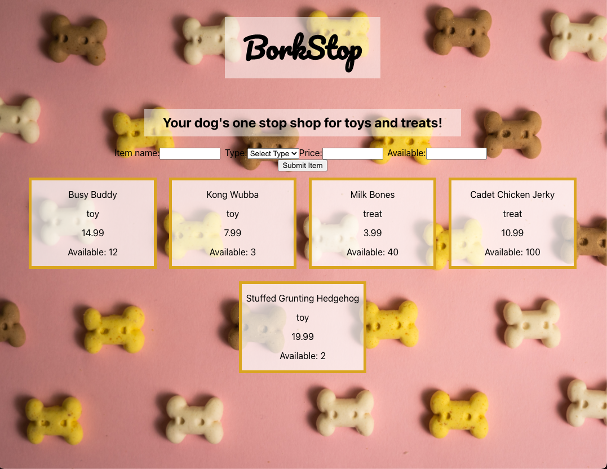

# Unofficial React Practice Assessment

Build an app that displays all available items in the BorkStop Shop. Allow an admin to add new items to the shop.

You have 3 hours to build this application. 

### Iteration 0

Set up the API. Find instructions in the repo readme.

Do not nest the backend repo in the front end repo

### Iteration 1
Get all existing available items on page load and display them on the dom. 

It does not need to look identical to the mock up at this time. Focus on displaying the data.

### Iteration 2

Create a controlled form component to create a new item for the shop (look into the API documentation to see what information is expected and what datatypes each piece should be). As a user types into the input fields, the form component's state should change (this is what 'controlled from' means). When the user clicks the 'Add New Item' button, the applicaiton should update the App's state. The new item should display with all of the other items. 

Do not worry about making the POST to the backend yet. Focus on getting it to work without that first. This means that it is okay that the new item disappears when the page is refreshed. 

### Iteration 3

Add some tests. The should cover:
- What should be displayed on the page when the user first visits
- When data is typed into the form, the value is reflected in the form input
- The flow of adding a new item to the shop inventory

### Iteration 4 

Add in the POST functionality that you skipped over in Iteration 2. When the user adds a new item to the shop, the application should POST to the API. The new item should still exist when the page is refreshed. 

You may keep any API calls you make in the App component or wherever is easiest for you. 

### Iteration 5 (extension)

Add a Delete button to each item in the shop so that an admin can remove an item that is out of stock. The deletion should persist upon page load, so you'll need to communicate appropriately to the API.